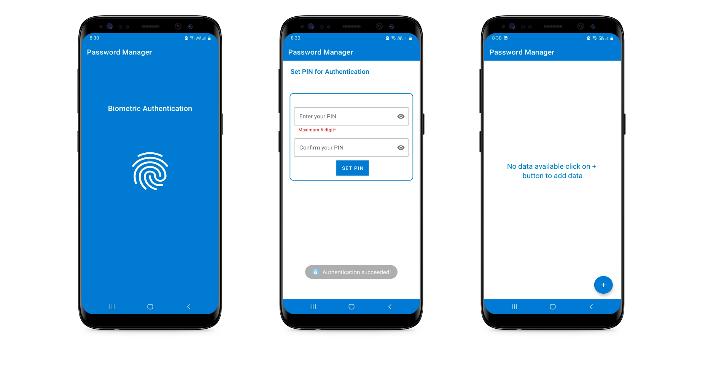
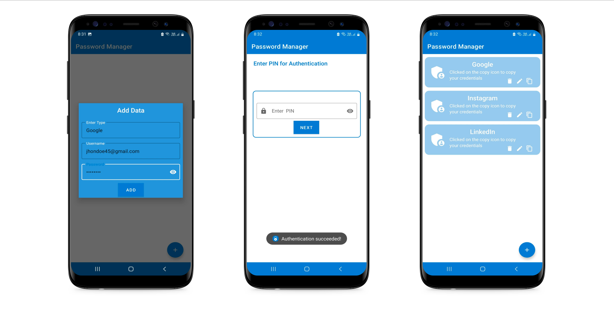

# 🔐 Password Protector App (Android)

This is a simple **Password Protector Android App** built with ❤️ to securely store and manage your passwords **offline** on your Android device.

---
# Snapshots

The Password Manager is an Android application developed in Java that allows you to securely store and manage your passwords locally on your device. This password manager ensures the privacy and security of your passwords through AES encryption and offers biometric authentication for enhanced protection.

 
 

## 📲 How to Install the App

You can install the `.apk` file manually by following the steps below:

### ✅ Step 1: Download the APK

1. Go to the [**Releases** section](https://github.com/Mohitscodiclab/Hackthon_Project/releases/tag/assets) of this repository.
2. Under the **Latest Release**, find the `app-releaase.apk` file listed under **Assets**.
3. Click the `.apk` file to download it to your Android device.

> 💡 If you're on a PC, transfer the `.apk` file to your phone via USB, Bluetooth, or any cloud storage (Google Drive, etc.).

---

### ✅ Step 2: Enable "Install Unknown Apps"

Android by default blocks installation from unknown sources. To allow it:

1. Open **Settings** on your Android phone.
2. Go to **Apps** → **Special App Access** → **Install Unknown Apps**.
3. Select the browser or file manager you’re using (e.g., Chrome or Files).
4. Toggle **"Allow from this source"** to ON.

> 🔒 Don't worry, this app works completely offline and doesn't access your private data or internet.

---

### ✅ Step 3: Install the APK

1. Locate the downloaded `Releases.apk` file using your **File Manager**.
2. Tap the file and select **Install**.
3. Wait for installation to complete.
4. Once installed, tap **Open** to launch the app.

---

## 🔐 Features

- 🛡️ Offline password storage
- 🔏 Master PIN to protect your vault
- 💡 Simple UI for quick access
- 🧠 No cloud sync = full control of your data

---
## 📧 Support

Have questions or suggestions?

- GitHub: [@mohitscodiclab](https://github.com/mohitscodiclab)

## Features
- Store and manage passwords securely on your device.
- AES encryption to protect password data.
- Biometric authentication for added security.

## License
The Password Manager Android application is open-source and released under the [MIT License](LICENSE).

# Acknowledgments

The Password Manager Android application utilizes the following open-source libraries:
- [BiometricPrompt](https://developer.android.com/reference/android/hardware/biometrics/BiometricPrompt) - Used for biometric authentication.

## ⚠️ Important Notes

- This app is **not available on Play Store**, so all updates will be released through the GitHub **Releases** section.
- If you update the app manually, make sure to **backup** any important data beforehand.
- For any issues, suggestions, or bugs, feel free to [open an issue](https://github.com/mohitscodiclab/your-repo-name/issues).

## Disclaimer

The Password Manager Android application is intended for personal use and does not guarantee absolute security of your passwords. It is always recommended to use additional security measures and follow best practices to protect your sensitive information.
---

> 🔐 _Your passwords, your control – completely offline._
